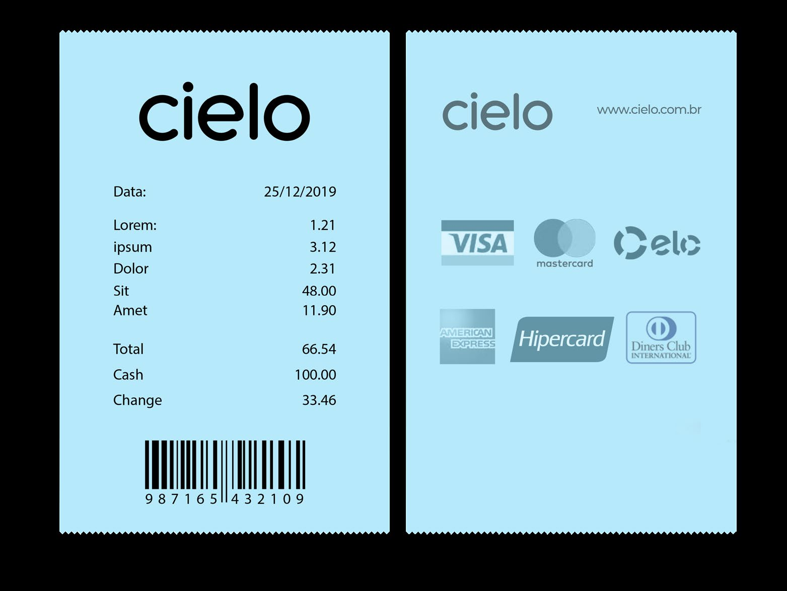
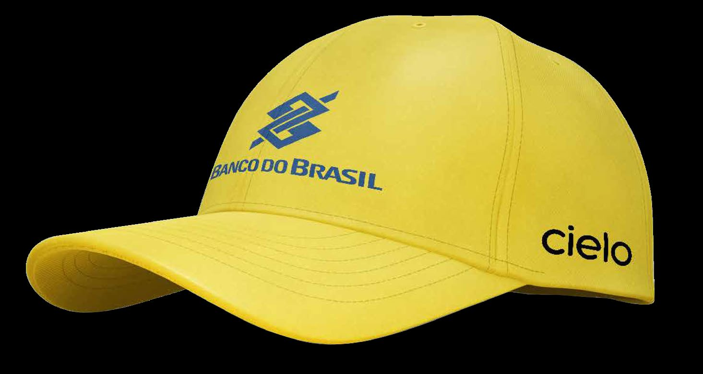

# 📘 Cielo — Brandbook

> **Data de Publicação:** Setembro / 2020  
> **Classificação:** Uso Interno e Fornecedores Autorizados (Confidencial)

---

## 📌 Sumário

1. [Visão Geral da Marca](#-visão-geral-da-marca)
2. [Logotipo Cielo](#-logotipo-cielo)
    - [Versões Preferenciais](#versões-preferenciais)
    - [Área de Proteção e Dimensões Mínimas](#área-de-proteção-e-dimensões-mínimas)
    - [Uso Restrito e Ultrarrestrito](#uso-restrito-e-ultrarrestrito)
    - [Usos Incorretos](#usos-incorretos)
3. [Regras para Nomes de Produtos e Serviços](#-regras-para-nomes-de-produtos-e-serviços)
4. [Paleta de Cores](#-paleta-de-cores)
    - [Cores Primárias](#cores-primárias)
    - [Cores Secundárias](#cores-secundárias)
    - [Cores de Apoio](#cores-de-apoio)
5. [Árvore de Decisão de Aplicação](#-árvore-de-decisão-de-aplicação)
6. [Termos e Direitos Autorais](#-termos-e-direitos-autorais)

---

## 📖 Visão Geral da Marca


> *“A nossa marca assina tudo o que fazemos.  
> É com ela que o mercado nos identifica e reconhece.  
> É com ela que os nossos públicos constroem relações e confiança.  
> É com ela que crescemos e nos inspiramos todos os dias.”*

---

## 🎨 Logotipo Cielo

O logotipo é o principal elemento visual da marca Cielo. Para garantir a consistência e o reconhecimento da marca em todos os pontos de contato, **utilize
sempre os arquivos originais do logo**.

### Versões Preferenciais


Estas são as versões preferenciais, desenvolvidas para serem utilizadas em todos os tipos de comunicação:

| Versão                  | Aplicação Preferencial | Descrição                                                            |
|:------------------------|:-----------------------|:---------------------------------------------------------------------|
| **Branco + Azul Cielo** | Fundos Escuros         | Utilizar preferencialmente sobre fundos escuros, em especial o azul. |
| **Cinza + Azul Cielo**  | Fundos Claros          | Utilizar sobre fundos brancos e de tonalidades claras.               |

---

### Área de Proteção e Dimensões Mínimas



#### Área de Proteção

Para garantir a legibilidade e o reconhecimento do logo, ele deve ser aplicado mantendo uma distância mínima de qualquer outro elemento gráfico (textos, bordas,
imagens, etc.).

- A unidade de referência **x** equivale à **altura da letra “c”** do próprio logo.
- Esta margem de proteção deve ser respeitada em todos os lados: acima, abaixo, à esquerda e à direita do logo.



#### Dimensões Mínimas

Para garantir a perfeita leitura mesmo em formatos reduzidos, respeite as dimensões mínimas estabelecidas:

| Meio              | Dimensão Mínima     |
|:------------------|:--------------------|
| 💻 **Digital**    | `40 px` de largura  |
| 🖨️ **Impressão** | `2,5 mm` de largura |

---

### Uso Restrito e Ultrarrestrito

#### 1. Versões Restritas

Aplicações monocromáticas destinadas exclusivamente a cenários com limitações de impressão:

1. Impressão em caixas de embarque (papelão).
2. Documentos e formulários impressos em preto e branco.

> ⚠️ **Atenção:** Consulte previamente a equipe de Marketing para a validação do uso destas versões.

#### 2. Versões Ultrarrestritas

Recurso utilizado em ocasiões extremas, em que não há possibilidade de aplicação das versões coloridas ou da versão monocromática padrão do logotipo:

- **Fundos Claros:** Utilizar a versão ultrarrestrita **preta**.
- **Fundos Escuros:** Utilizar a versão ultrarrestrita **branca**.

> 🛑 **Importante:** Estas aplicações devem ser sempre previamente aprovadas pela área de Marketing da Cielo.

---

### Usos Incorretos


Nunca altere o logo nem o reconstrua a partir do zero. Para garantir o seu reconhecimento, use sempre os arquivos originais.

- ❌ **Não crie cortes** ou reduções de partes do logo.
- ❌ **Não altere** a combinação de cores padrão.
- ❌ **Não distorça** nem incline as proporções.
- ❌ **Não utilize em linha** continuada em meio a textos.
- ❌ **Não altere a tipografia** original.
- ❌ **Não aplique sobre fundos sem contraste** adequado.

> 💡 **Vale notar:** Para aplicações em que haja variação de cores nas imagens de fundo (como em vídeos), utilize uma área de proteção / mascaramento no logo
> para garantir o contraste tanto em tons claros quanto escuros.

---

## 🏷️ Regras para Nomes de Produtos e Serviços

Para manter a consistência da arquitetura de marcas da Cielo:

- ✍️ **Tipografia:** A tipografia para nomes de produtos e serviços deve ser sempre a fonte **Montserrat**, sem adição de outros elementos gráficos ou cores não
  previstos na identidade visual.
- 🚫 **Uso do Logo:** **Não** utilize o logotipo da Cielo como uma "palavra" dentro de títulos ou textos corridos.

| Aplicação       | Exemplo                                                  |
|:----------------|:---------------------------------------------------------|
| ❌ **Incorreto** | `[Logo Cielo] Farol`                                     |
| ✅ **Correto**   | `Cielo Farol` *(em texto utilizando a fonte Montserrat)* |

#### Diretrizes de Redação

1. **Precedência Obrigatória:** Os nomes de produtos sempre devem ser precedidos pela palavra **“Cielo”** (ex: *Cielo Farol*, *Cielo Promo*).
2. **Citação Secundária:** Em textos longos onde a marca “Cielo” já foi citada no contexto, pode-se referenciar apenas o nome do produto no decorrer da frase:
   > *Exemplo:* “A Cielo conta com diversas soluções, por exemplo o **Farol**, que traz informações do mercado e de negócios similares para te ajudar na
   gestão...”
3. **Múltiplos Produtos:** Ao citar mais de um produto na mesma sentença, pode-se utilizar a palavra “Cielo” apenas uma vez:
   > *Exemplo:* “Conte com o **Cielo Farol e o Promo** para o seu negócio seguir em frente.”

---

## 🎨 Paleta de Cores

### Cores Primárias

A paleta principal reúne as cores de maior reconhecimento da identidade Cielo. O **Azul Cielo (Meio-dia)** é o tom assinatura e deve estar presente em todas as
peças de comunicação.

| Nome da Cor                 | Pantone        | CMYK            | RGB            | HEX       |
|:----------------------------|:---------------|:----------------|:---------------|:----------|
| **Azul Cielo** *(Meio-dia)* | PANTONE CYAN   | C100 M0 Y0 K0   | R0 G174 B239   | `#00AEEF` |
| **Entardecer**              | PANTONE 285 C  | C90 M50 Y0 K0   | R1 G124 B235   | `#017CEB` |
| **Anoitecer**               | PANTONE 7687 C | C100 M70 Y0 K20 | R32 G73 B134   | `#204986` |
| **Chuva**                   | PANTONE 431 C  | C15 M5 Y0 K70   | R90 G100 B110  | `#5A646E` |
| **Branco Cielo**            | —              | C0 M0 Y0 K0     | R255 G255 B255 | `#FFFFFF` |

---

### Cores Secundárias

A paleta secundária existe para trazer riqueza e diversidade ao sistema visual. Quando utilizadas, essas cores — combinadas ou não — **não devem ultrapassar 30%
da área total** da peça.

| Nome da Cor    | Pantone        | CMYK           | RGB            | HEX       |
|:---------------|:---------------|:---------------|:---------------|:----------|
| **Pistache**   | PANTONE 379 C  | C15 M0 Y74 K0  | R224 G229 B102 | `#E0E566` |
| **Pôr do Sol** | PANTONE 1925 C | C0 M100 Y52 K0 | R247 G0 B77    | `#E0004D` |
| **Crepúsculo** | PANTONE 526 C  | C70 M100 Y0 K0 | R116 G46 B152  | `#742E98` |

---

### Cores de Apoio

Cores destinadas a suporte técnico, como textos e elementos secundários de menor presença.

| Nome da Cor         | Pantone             | CMYK         | RGB            | HEX       |
|:--------------------|:--------------------|:-------------|:---------------|:----------|
| **Nuvem**           | WARM GRAY 1 C (30%) | C5 M5 Y5 K0  | R241 G242 B242 | `#F1F2F2` |
| **Noite** *(Preto)* | BLACK (90%)         | C0 M0 Y0 K90 | R35 G31 B32    | `#231F20` |

---

## 🌳 Árvore de Decisão de Aplicação

Para aplicar a versão do logo mais adequada a cada ocasião, siga o organograma de decisão abaixo:


```mermaid
flowchart TD
    A[Início: Aplicação do Logo] --> B{A Cielo tem controle<br/>do contexto de uso?}
    
    B -- SIM --> C{É sobre fundo azul Cielo<br/>ou azul Entardecer?}
    C -- SIM --> R1[<b>Logo Branco + Azul Cielo</b>]
    C -- NÃO --> D{É sobre fundo<br/>branco ou claro?}
    D -- SIM --> R2[<b>Logo Cinza + Azul Cielo</b>]
    D -- NÃO --> R1

    B -- NÃO --> E{O logo pode<br/>ser colorido?}
    E -- SIM --> F{É sobre fundo<br/>branco ou claro?}
    F -- SIM --> R2
    F -- NÃO --> R1

    E -- NÃO --> G{A reprodução gráfica<br/>é de boa qualidade?}
    G -- SIM --> R3[<b>Versão Monocromática</b><br/><i>(Uso Restrito)</i>]
    G -- NÃO --> R4[<b>Versão Ultrarrestrita</b><br/><i>(Preta em fundos claros / Branca em escuros)</i>]
```

---

## 🔒 Termos e Direitos Autorais

- **Manual de Marca:** Sempre consulte este manual ao utilizar a marca Cielo. Para casos não abordados neste documento, entre em contato diretamente com a área
  de Marketing.
- **Confidencialidade:** O conteúdo deste manual é confidencial e de uso interno (ou destinado a fornecedores autorizados).
- **Direitos de Imagem:** As fotos veiculadas neste documento são meramente ilustrativas e de propriedade de terceiros, titulares dos direitos autorais. Fica
  vedada sua reprodução sem autorização da área responsável.

---

*Setembro, 2020.*