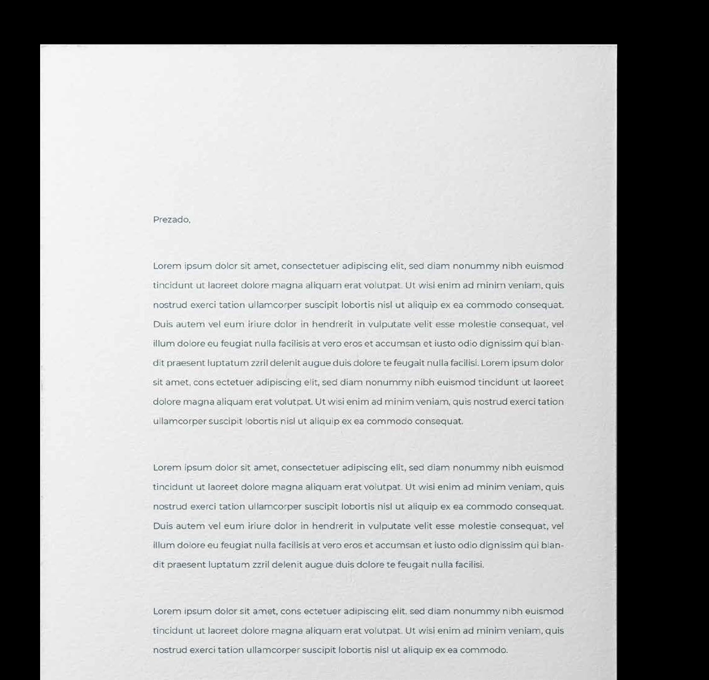
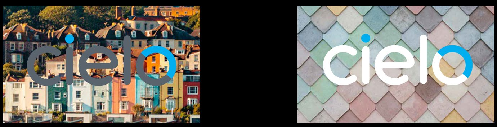

brandbook • setembro/2020

Logo
Principal
A nossa marca assina tudo
o que fazemos.
30
É com ela que o mercado
nos identifica e reconhece.
É com ela que os nossos
públicos constróem
relações e confiança.
É com ela que crescemos
e nos inspiramos todos
os dias.
Importante: utilize sempre os arquivos originais do logo.
oleic
koobdnarb

Logos
Alternativos
O logo é o principal
elemento visual
da marca Cielo.
branco + azul Cielo cinza + azul Cielo
Estas são as versões
preferenciais, feitas
para serem usadas
em todos os tipos
de comunicação.
Cores primárias
31
Azul Cielo
PANTONE CYAN
C100 M0 Y0 K0
R000 G174 B239
#00AEEF
Branco Cielo
C0 M0 Y0 K0
R255 G255 B255
#FFFFFF
Use sempre esta versão Use sempre esta
Anoitecer
sobre fundos escuros, versão para fundos
7687 C
C100 M70 Y0 K20
preferencialmente azul. brancos e claros.
R032 G073 B134
#204986
Chuva
431 C
C15 M5 Y0 K70
R090 G100 B110
#5A646E
oleic
koobdnarb

Logo
Área de proteção Dimensões mínimas
Para garantir legibilidade e Para garantir a leitura do logo
reconhecimento, o logo deve mesmo em áreas reduzidas,
ser aplicado com, no mínimo, respeite as dimensões mínimas
x de distância de qualquer x descritas abaixo.
outro elemento gráfico,
como ilustrado ao lado.
x
Essa é a chamada área
de proteção do logo, que
deve ser respeitada sempre.
x
A unidade de referência “x”
é a altura da letra “c” do
x
logo, devendo ser aplicada
32
acima, abaixo e nos lados
da palavra “Cielo”.
x
Picid quist quatis accatius duciaerore, ommolle strumqu atecti beris
velisi quia solorepudam nos ma dis et lamet, que elitas santotatur, etur,
ex et parum anducie nderum soluptatendi ulpa vellique verias poria
vollab il excea am sitam sinum aut illorei umenisi tatureptatur aut etur?
Or as dit harum et expeliquatem voluptatur, cuptaeperios asped quate
litia pra in pel maximin cienti dolum res maiorat facesti doluptati
digital 40 px
dolorerrum delitis quaspis mos quid utection pra di ipsam seque
doluptatem faceat ut peliquis eatiam, aut omni repernam lique volum
es estorpos ea velectecus reriae volo conem rem alique voluptum
inum que et aut volorum ium evendel liquae occusam fugias none
est quiderundi sit et explacepre pe cor maxime nobit ex est voluptate
impressão 2,5 mm
inumquissit accum nullis rae nuscit est auditas sim volupid enturiorpos
de es audi ditia cori totam inctur sincia dellaboratem rem int por mil
maximus voluptat esequo inita voluptatias iusa volores in enet et
lignatius et officim usciis ressitat landipsamet occus milluptatus pratent
otamendias re, que re nos aperumque vel magnim voloribus aut aut
omnimust es et adis aliam que denes dio cusdaeriam alibus. Odi ut prem
facerit is dolor repera verum quatest aut ditione mquatur simi, nem is
oleic
koobdnarb

Logo
Uso restrito
Os logos nas versões restritas
são aplicados somente em
ocasiões de limitação, como:
1. impressão em caixas
de embarque (papelão);
2. documentos em preto
e branco.
33
Consulte previamente a equipe de marketing para
a validação do uso destas versões.
oleic
koobdnarb

Logo
Ultrarrestrito
34
Em ocasiões extremas, em que não há a possibilidade de uso das versões
coloridas ou da versão monocromática do logotipo da Cielo, podemos recorrer
à aplicação da versão ultrarrestrita.
Nestes casos, para fundos com tons claros, devemos usar a versão
ultrarrestrita preta; e para fundos com tons escuros, devemos utilizar a
versão ultrarrestrita branca.
Importante: estas aplicações devem ser sempre previamente aprovada
pela área de Marketing da Cielo.
Importante: utilize sempre os arquivos originais do logo.
oleic
koobdnarb

Não crie cortes. Não altere a combinação
Logo
de cores.
Usos incorretos
Nunca altere o logo, nem o construa do zero.
Não distorça. Não incline nem distorça.
Para garantir o seu reconhecimento,
use sempre os arquivos originais da marca.
Vale notar:
35
CIEL
Usar proteção no logo como o modelo
abaixo, para aplicações em que haja
variação de cores nas imagens, seja para Não utilize em linha. Não altere a tipografia.
tons claro ou escuros, como por exemplo
em vídeos.
Uso correto
Não aplique sobre fundos Não aplique sobre fundos
sem contraste. sem contraste.
oleic
koobdnarb

Logo
Usos incorretos
Exemplo Cielo Farol
Não devemos usar o logotipo da
Cielo como "palavra" em títulos ou
textos.
A tipografia para nomes de
produtos e serviços deve ser
sempre a Montserrat, sem adição
de outros elementos gráficos e/ou
Forma incorreta Forma correta
cores não previstos na identidade
visual da Cielo.
36
Regras para nomes de produtos e seviços
Os nomes de produtos sempre devem ser precedidos por “Cielo”
Em peças ou apresentacões, “Cielo” deve sempre ser escrito com a fonte Montserrat – não devemos usar o logotipo como uma palavra
Em frases em que a marca “Cielo” já foi citada, podemos citar apenas o nome do produto:
- Exemplo: A Cielo conta com diversas soluções, por exemplo o Farol, que traz informações do mercado e de negócios similares para te ajudar na gestão do
seu negócio, etc...
Quando citamos mais de um produto, podemos usar somente uma vez o nome “Cielo”:
- Exemplo: Conte com o Cielo Farol e o Promo para o seu negócio seguir em frente
oleic
koobdnarb

oleic koobdnarb
Principais
Logo
Cores principais
e secundárias
A paleta principal tem as cores
de maior reconhecimento da
identidade Cielo. Entre os azuis,
| Azul Cielo (meio-dia) | Entardecer | Anoitecer | Chuva | Branco Cielo |
| --------------------- | ---------- | --------- | ----- | ------------ |
PANTONE CYAN 285 C 7687 C 431 C C0  MO  Y0  K0 o meio-dia é o azul da Cielo
| C100  M0  Y0  K0 | C90  M50  Y0  K0 | C100  M70  Y0  K20 | C15  M5  Y0  K70 | R255  G255  B255 |
| ---------------- | ---------------- | ------------------ | ---------------- | ---------------- |
e deve estar sempre presente
| R000  G174  B239 | R001  G124  B235 | R032  G073  B134 | R090  G100  B110 | #FFFFFF |
| ---------------- | ---------------- | ---------------- | ---------------- | ------- |
nas peças. 37
| #00AEEF | #017CEB | #204986 | #5A646E |     |
| ------- | ------- | ------- | ------- | --- |

A paleta secudária existe para
trazer riqueza e diversidade
Secundárias Apoio
ao sistema. Quando utilizadas,
essas cores — combinadas
ou não — não devem ultrapassar
30% da área da peça.
O preto e o branco nuvem são
cores de apoio e podem ser
utilizadas em textos e elementos
de menor presença.
| Pistache         | Pôr do sol        | Crepúsculo        | Nuvem               | Noite            |
| ---------------- | ----------------- | ----------------- | ------------------- | ---------------- |
| 379 C            | 1925 C            | 526 C             | WARM GRAY 1 C (30%) | BLACK (90%)      |
| C15  M0  Y74  K0 | C0  M100  Y52  K0 | C70  M100  Y0  K0 | C5  M5  Y5  K0      | C0  M0  Y0  K90  |
| R224  G229  B102 | R247  G0  B077    | R116  G046  B152  | R241  G242  B242    | R035  G031  B032 |
| #E0E566          | #E0004D           | #742E98           | #F1F2F2             | #231F20          |

Árvore de decisão
Para aplicar a versão mais adequada para cada ocasião, siga o
organograma desta árvore de decisão. Para outras situações fora destes
Uso de logos e fundos
contextos, consulte a equipe de marketing para a melhor opção de uso.
SI M
?
É sobre fundo
SIM azul Cielo ou azul
Entardecer?
? SIM
É sobre fundo
NÃO
branco ou claro?
?
NÃO
A Cielo tem 41
controle
do contexto
? SIM
de uso?
É sobre fundo
SI M
branco ou claro?
? NÃO
O logo pode
NÃO
ser colorido?
? SIM
A reprodução
NÃO gráfica é de boa
qualidade?
NÃO
oleic
koobdnarb

Sempre consulte este manual ao utilizar
a marca Cielo. Para casos não citados aqui,
fale com a área de marketing.
O conteúdo deste manual é confidencial
e de uso interno (ou destinado
a fornecedores autorizados).
As fotos aqui veiculadas são meramente
ilustrativas e de propriedade de terceiros,
titulares dos direitos autorais. Fica vedada,
portanto, sua reprodução sem autorização
da área responsável.
Setembro, 2020.

## Extracted Images

### Page 1

### Page 5

### Page 6

### Page 7

### Page 11

